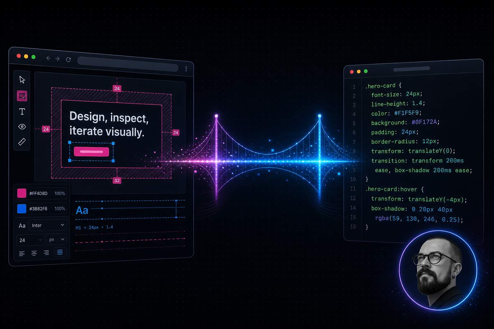

<p align="center">
  
</p>

<h1 align="center">VisBug MCP Bridge</h1>

<p align="center">
  <strong>Русская локализация форка</strong> <a href="https://github.com/mambari/visbug-mcp">mambari/visbug-mcp</a><br>
  Мост <strong>VisBug → Cursor</strong> через MCP: визуальные правки на <code>localhost</code> попадают в агента как структурированный CSS-diff.
</p>

<p align="center">
  
  
  
</p>

---

## Архитектура

```
Chrome (VisBug + расширение)
        │  WebSocket ws://127.0.0.1:4844
        ▼
┌─────────────────┐      ~/.visbug-mcp/changes.json
│  ws-daemon.js   │ ◄──────────────────────────────►  src/server.js (MCP stdio)
│  (pm2 / фон)    │                                    └─ запускается Cursor
│                 │                                       по запросу
└─────────────────┘
```

- **`src/ws-daemon.js`** — автономный WebSocket-сервер. Работает в фоне (pm2 или PowerShell-скрипт). Принимает мутации от расширения и сохраняет их в `~/.visbug-mcp/changes.json`.
- **`src/server.js`** — MCP-сервер (stdio). Запускается Cursor по запросу. Читает и пишет общий файл store. WebSocket не открывает.
- **`extension/`** — расширение Chrome. Content-script на `localhost` наблюдает за DOM; popup показывает статус и кнопки управления.

### Безопасность

- WebSocket только `ws://127.0.0.1:4844` — данные не уходят в интернет
- Хранилище только `~/.visbug-mcp/changes.json` на вашем компьютере
- Внешних HTTP-запросов нет

---

## Установка

### 1. Зависимости

```bash
git clone https://github.com/samsebeingener/visbug-mcp-ru.git
cd visbug-mcp-ru
npm install
```

### 2. WebSocket-демон

**Windows (PowerShell):**

```powershell
powershell -ExecutionPolicy Bypass -File scripts/start-ws-daemon.ps1
```

**macOS / Linux (pm2):**

```bash
npm install -g pm2
pm2 start src/ws-daemon.js --name visbug-ws
pm2 startup
pm2 save
```

Демон слушает `ws://127.0.0.1:4844` и перезапускается при сбое.

### 3. Расширение Chrome

1. Откройте `chrome://extensions`
2. Включите **режим разработчика** (переключатель справа вверху)
3. Нажмите **«Загрузить распакованное расширение»**
4. Выберите папку `extension/`

Иконка в панели Chrome открывает popup со статусом подключения к демону.

### 4. MCP в Cursor

Добавьте в `~/.cursor/mcp.json`:

```json
"visbug-mcp": {
  "command": "node",
  "args": ["C:/путь/к/visbug-mcp-ru/src/server.js"]
}
```

После правок `mcp.json` — **Reload Window** в Cursor.

---

## Как пользоваться

### Рабочий процесс

1. Запустите dev-сервер (`npm run dev`) и откройте сайт на `http://localhost:…` в Chrome — content-script подключится к демону автоматически
2. Вносите правки в VisBug (цвета, отступы, типографика…)
3. В Cursor вызовите MCP `get_changes` или нажмите **«Скопировать правки»** в popup расширения
4. Попросите агента применить изменения в CSS → затем `apply_changes`

### Popup Chrome

| Индикатор | Значение |
|---|---|
| 🟢 Подключено к MCP-серверу | Демон онлайн, захват активен |
| 🔴 MCP-сервер не запущен | Демон остановлен — перезапустите скрипт или `pm2 start` |
| `N правок в буфере` | Неприменённых изменений в очереди |

| Кнопка | Действие |
|---|---|
| **Скопировать правки** | Копирует форматированный список в буфер обмена |
| **Очистить правки** | Сбрасывает store и storage VisBug |

### MCP-инструменты

#### `get_changes`

Возвращает захваченные визуальные правки (ещё не применённые).

```
Параметры:
  filter  (опционально): "style" | "attribute" | "text" | "node-added" | "node-removed"
```

Пример вывода:

```
[0] .card > h2 → стиль: font-size = 18px (было: 16px)
[1] .btn--primary → стиль: background = rgb(59, 130, 246) (было: rgb(99, 102, 241))
[2] #hero-title → текст: «Новый заголовок» (было: «Старый заголовок»)
```

#### `apply_changes`

Помечает правки как применённые (после записи в исходники).

```
Параметры:
  ids  (опционально): массив индексов — пусто = пометить всё
```

#### `clear_changes`

Полностью очищает буфер.

---

## Техническое поведение

### Период «тишины» (2 секунды)

При каждой перезагрузке страницы VisBug повторно применяет свои сохранённые правки из `chrome.storage.local`. Эти мутации приходят в первую секунду и неотличимы от действий пользователя.

Демон **игнорирует все мутации в первые 2 секунды** после подключения WebSocket content-script.

### Дедупликация

Парсер (`src/parser.js`) хранит `Map` (`seen`) по ключу `selector|type|свойство`. Если одно свойство менялось несколько раз — сохраняется только последнее значение.

### Персистентность (file store)

Правки пишутся в `~/.visbug-mcp/changes.json` после каждой новой мутации. Это **общий источник правды** между демоном и MCP-сервером.

```json
{
  "changes": [
    {
      "type": "style",
      "selector": ".card > h2",
      "property": "font-size",
      "oldValue": "16px",
      "newValue": "18px",
      "tag": "H2",
      "url": "http://localhost:3001/",
      "timestamp": 1711234567890,
      "applied": false
    }
  ]
}
```

### Фильтрация шума

Парсер автоматически игнорирует:

- внутренние селекторы VisBug (`#vibe-annotations-root`, `vis-bug` и т.д.)
- scoped CSS-переменные Vue (`--dc13a441-…`)
- классы Vue Router (`router-link-active`, transitions)
- мутации `node-added` / `node-removed` (рендер Vue)
- длинные начальные тексты (дамп первого рендера)
- атрибуты `contenteditable` (внутреннее использование VisBug)

---

## Полезные команды

```bash
# Статус демона (pm2)
pm2 status visbug-ws

# Логи в реальном времени
pm2 logs visbug-ws

# Перезапуск
pm2 restart visbug-ws

# Разработка с автоперезагрузкой
npm run daemon:watch

# Очистить store вручную
echo '{"changes":[]}' > ~/.visbug-mcp/changes.json
```

---

## Структура проекта

```
visbug-mcp-ru/
├── assets/
│   ├── cover-banner.png     # обложка README
│   └── social-preview.jpg   # превью при шаринге (копия баннера)
├── src/
│   ├── ws-daemon.js         # WebSocket-демон (фон)
│   ├── server.js            # MCP stdio (Cursor)
│   └── parser.js            # парсинг, дедупликация, формат
├── extension/
│   ├── manifest.json        # Chrome Manifest v3
│   ├── content-script.js    # DOM + WebSocket-клиент
│   ├── popup.html           # интерфейс popup (RU)
│   ├── popup.js
│   └── background.js
├── scripts/
│   └── start-ws-daemon.ps1  # запуск демона на Windows
├── README.md                # этот файл
├── README.ru.md             # краткая версия
└── FORK.ru.md               # заметки о форке
```

---

## Что переведено на русский

- Popup расширения Chrome
- Описания MCP-инструментов и ответы сервера
- Формат строк в `get_changes` и буфере обмена («было», «текст», «CSS»)

---

## Лицензия и upstream

Основано на [mambari/visbug-mcp](https://github.com/mambari/visbug-mcp). VisBug — [GoogleChromeLabs/ProjectVisBug](https://github.com/GoogleChromeLabs/ProjectVisBug).

---

<p align="center">
  <strong>Никита Куликов</strong><br>
  <a href="https://samsebeingener.ru">samsebeingener.ru</a>
</p>
