# Layout Solve Contract — Phase B

Версия: 2026-07-29 · статус: **черновик контракта**  
Проект: `visbug-mcp-ru` · модуль: `layout-solver` (планируется)

---

## 1. Цель и закон

### Цель

Перевести VisBug **MOVE** из визуального `transform: translate(...)` в **семантические правки layout** — `gap`, `margin-*`, utility-классы — так, чтобы исходники оставались читаемыми и предсказуемыми для diff/undo.

### Закон (инвариант)

> **Соседи не двигаются. Двигается только целевой блок (или его непосредственная обёртка).**

| Разрешено | Запрещено |
|-----------|-----------|
| Изменить `gap` у flex/grid-родителя | `transform` на целевом элементе в flow-layout |
| Добавить/изменить `margin-top` / `margin-inline-start` на обёртке целевого блока | Сдвигать соседние элементы через transform/margin |
| Убрать устаревший `transform` из overlay CSS при успешном layout-solve | Писать `left`/`top` как persistent inline-style в flow |

**Flow-layout** — контекст, где целевой узел участвует в нормальном потоке (`display: block`, `display: flex` у предка без `position: absolute/fixed` на целевом узле).

VisBug в браузере по-прежнему рисует drag через transform (preview). При **записи** в буфер и при **apply** transform в flow запрещён — вместо него формируется `layoutIntent` и вызывается layout-solver.

---

## 2. Схема `layoutIntent` (JSON)

`layoutIntent` — снимок геометрии и контекста в момент snap/drop. Хранится внутри `MOVE.align` (Actions v2) или как отдельное поле `layoutIntent` при миграции.

```json
{
  "version": 1,
  "viewport": {
    "width": 1440,
    "height": 900,
    "devicePixelRatio": 1
  },
  "dragRectBefore": {
    "left": 100,
    "top": 200,
    "width": 400,
    "height": 80
  },
  "dragRectAfter": {
    "left": 139,
    "top": 131,
    "width": 400,
    "height": 80
  },
  "targetRect": {
    "left": 100,
    "top": 200,
    "width": 400,
    "height": 80
  },
  "parent": {
    "selector": "body > main > section.hero-section > div.hero-text-inner",
    "tag": "div",
    "computed": {
      "display": "flex",
      "flexDirection": "column",
      "gap": "24px",
      "alignItems": "stretch",
      "justifyContent": "flex-start"
    }
  },
  "prevSibling": {
    "selector": "body > main > section.hero-section > div.hero-text-inner > p.chapter",
    "tag": "p",
    "rect": {
      "left": 100,
      "top": 120,
      "width": 300,
      "height": 24
    },
    "computed": {
      "display": "block",
      "marginBottom": "0px"
    }
  },
  "nextWrapper": {
    "selector": "body > main > section.hero-section > div.hero-text-inner > div.space-y-2",
    "tag": "div",
    "rect": {
      "left": 100,
      "top": 168,
      "width": 400,
      "height": 112
    },
    "computed": {
      "display": "block",
      "marginTop": "0px"
    },
    "containsTarget": true
  },
  "align": {
    "mode": "edge",
    "axis": "y",
    "edge": "top",
    "distance": 0,
    "reference": {
      "selector": "body > main > section.hero-section > div.hero-text-inner > p.chapter",
      "tag": "p",
      "edge": "bottom",
      "rect": {
        "left": 100,
        "top": 120,
        "width": 300,
        "height": 24
      }
    }
  }
}
```

### Поля

| Поле | Назначение |
|------|------------|
| `viewport` | Размеры окна при записи; нормализация px ↔ rem при необходимости |
| `dragRectBefore` | Bounding box целевого элемента до drag |
| `dragRectAfter` | Bounding box после drop (визуальная позиция) |
| `targetRect` | Синоним `dragRectBefore` или rect целевого leaf (h1), если drag на обёртке |
| `parent.computed` | Вычисленный стиль flex/grid-контейнера — определяет доступные рычаги |
| `prevSibling` | Непосредственный предшествующий sibling (eyebrow / `p.chapter`) |
| `nextWrapper` | Блок-обёртка сразу после reference; обычно получает `margin-top` |
| `align` | Snap-метаданные из `alignment-guides.js` (edge, axis, reference) |

### Дельты (вычисляются solver'ом, не обязательны в intent)

```text
deltaY = dragRectAfter.top - (reference.rect.bottom + align.distance)
deltaX = dragRectAfter.left  - (reference.rect.left  + align.distance)   // для axis x
```

---

## 3. Порядок рычагов: `flex-col`

Для вертикального sibling-snap (`align.axis === 'y'`, `edge: top` → `reference.edge: bottom`) в контейнере `display: flex; flex-direction: column`:

```
1. gap родителя (flex-col gap-*)
      ↓ leftover > 1px
2. margin-top обёртки nextWrapper (или margin-top на целевом блоке, если обёртки нет)
      ↓ успех
3. strip устаревших transform в overlay CSS (hero h1 / .chapter)
```

### Правила применения

1. **Gap first.** Solver уменьшает/увеличивает `gap` родителя на величину `deltaY`, ограниченную текущим gap (gap не уходит ниже 0).
2. **Leftover → margin-top.** Остаток `leftover = deltaY - gapApplied` пишется в `margin-top` на `nextWrapper` (не на `prevSibling`).
3. **Один проход.** Не итерировать gap/margin циклически — максимум одна правка gap + одна правка margin.
4. **Порог.** `|leftover| < 1px` → margin не нужен.
5. **Классы vs inline.** Static HTML: Tailwind utilities (`gap-6` → `gap-1`, `-mt-[12px]`). Framework: `className` через AST (`mt-*`, `gap-*`).

### Горизонтальный snap (вне MVP, контракт зарезервирован)

`flex-row` / `margin-inline-start` на целевом элементе; gap по `column-gap` — Phase C.

---

## 4. Запрет `transform` в flow-layout

### Когда transform запрещён

- `parent.computed.display` ∈ `{ flex, block, grid }` (flow)
- Целевой узел не `position: absolute | fixed`
- MOVE с `align.reference` (sibling snap) или framework `visbugSrc` с ΔY/ΔX only

### Когда transform допустим (fallback, не layout-solver)

- Grid-aware `items-end` (выравнивание по низу ячейки)
- `position: absolute` / overlay / decorative слои
- Нет layoutIntent и нет распознанного flex-контекста → legacy CSS `transform` с warning

### Проверка (gate)

Перед записью patch:

```text
IF plan.kind === 'layout-solve' AND target in flow-layout
  THEN patch MUST NOT contain transform on target selector
```

Тест-референс: `test/move-spacing.test.js` — hero h1 без `transform` в `<style>`.

---

## 5. Интеграция в пайплайн

```mermaid
flowchart LR
  ext[extension snapshot]
  ws[ws-daemon]
  compile[compile.js]
  flatten[flatten.js]
  solver[layout-solver]
  patch[file-patch / ast-apply]

  ext -->|changes v1 + layoutIntent| ws
  ws -->|changes.json Actions v2| compile
  compile -->|MOVE + align.layoutIntent| store[(project store)]
  store --> flatten
  flatten -->|legacy left/top + align| autoApply[auto-apply.js]
  autoApply --> solver
  solver -->|gap / margin plan| patch
```



### По этапам

| Этап | Модуль | Ответственность |
|------|--------|-----------------|
| **extension** | `snapshot.js`, `alignment-guides.js` | При snap: `align.reference`, `dragRect`, `layoutIntent` (parent/prevSibling/nextWrapper rects) |
| **ws-daemon** | `ws-daemon.js` | Persist `changes.json` v2; не терять `layoutIntent` при merge |
| **compile** | `actions/compile.js` | Legacy `left`/`top` → `MOVE`; перенос `align` + `layoutIntent` |
| **flatten** | `actions/flatten.js` | Actions → legacy changes для `autoApplyWorkspace`; `align` на оба `left`/`top` |
| **layout-solver** | `src/layout-solver.js` *(новый)* | `layoutIntent` + delta → `{ lever, selector, prop, value, strategy }` |
| **patch** | `move-spacing.js`, `ast-apply.js`, `file-patch.js` | Применить plan; strip hero transforms |

### Контракт выхода solver'а

```json
{
  "ok": true,
  "strategy": "flex-col-gap-then-wrapper-margin",
  "steps": [
    { "lever": "parent-gap", "selector": "div.hero-text-inner", "from": "gap-6", "to": "gap-1", "appliedPx": 20 },
    { "lever": "wrapper-margin-top", "selector": "div.space-y-2", "prop": "margin-top", "value": "-8px", "appliedPx": -8 }
  ],
  "strippedTransforms": [".hero-section h1", ".hero-section .chapter"]
}
```

`auto-apply.js` вызывает solver **до** fallback на `transform`, если `planMoveApply` вернул layout-стратегию или есть `align.reference`.

---

## 6. MVP scope (Phase B)

### В scope

| Сценарий | Layout | Solver path |
|----------|--------|-------------|
| Hero eyebrow (`p.chapter`) + `h1` в `flex flex-col gap-*` | `static-html` | gap родителя → `-mt-*` на `div.space-y-2` |
| Тот же snap без `align` в буфере | `static-html` | `inferFlexSiblingSpacingContext` → synthetic align → solver |
| Framework Y-only MOVE с `data-visbug-src` | `framework-src` | `margin-top` на JSX-узле (AST), без transform |
| Strip legacy `transform` в hero overlay CSS | `static-html` | после успешного spacing |

### Вне scope (Phase C+)

- `flex-row` / horizontal sibling snap
- CSS Grid `gap` + `grid-area` moves
- Nested flex (обёртка внутри обёртки > 2 уровней)
- `space-y-*` как первичный рычаг (только gap родителя + margin обёртки)
- CMS / `dangerouslySetInnerHTML` (остаётся overlay CSS + warning)

### Критерии готовности MVP

- [x] `layoutIntent` пишется extension'ом при vertical sibling snap
- [x] `layout-solver.js` покрыт unit-тестами на hero fixture из `move-spacing.test.js`
- [x] `autoApplyWorkspace` не пишет `transform` на h1 в hero flow
- [ ] Framework path: `margin-top` через `ast-apply.js` при `visbugSrc`
- [x] Документирован `strategy` в patch-log / applyHistory

---

## 7. Фазы C–E (кратко)

### Phase C — Horizontal & grid

- `margin-inline-start` / `column-gap` для `flex-row`
- Grid-aware MOVE: `gap`, `justify-items`, `align-self` вместо translate
- Расширение `layoutIntent`: `gridTemplateColumns`, `gridColumn` reference

### Phase D — Unified solver + AST

- Единый `layout-solver` для `static-html` и `framework-src` (общий plan → разные patch adapters)
- Tailwind merge при правке `className` (`gap-*`, `mt-*`, `-mt-[Npx]`)
- Undo/redo по `steps[]` solver'а, не по сырому transform

### Phase E — Production & MCP

- MCP `apply_actions`: human summary с layout strategy (`gap-6 → gap-1, wrapper -mt-12px`)
- Agent prompt: «не предлагать transform в flow»
- Метрики: % MOVE без transform fallback; regression suite на реальных workspace

---

## 8. Связанные файлы

| Файл | Роль |
|------|------|
| `extension/alignment-guides.js` | Источник `align`, rects |
| `src/move-spacing.js` | Текущая реализация gap/margin (станет adapter patch) |
| `src/auto-apply.js` | `planMoveApply`, routing к solver |
| `src/actions/compile.js` | Legacy → Actions |
| `src/actions/flatten.js` | Actions → legacy |
| `test/move-spacing.test.js` | Acceptance tests MVP |

---

## 9. Глоссарий

| Термин | Значение |
|--------|----------|
| **layoutIntent** | JSON-снимок геометрии и computed-стилей для solver |
| **рычаг (lever)** | Одно допустимое изменение layout (gap, margin-top, …) |
| **nextWrapper** | Первый block-sibling после reference; контейнер целевого h1 |
| **flow-layout** | Нормальный поток без absolute positioning на целевом узле |
| **leftover** | Часть deltaY, не поглощённая изменением gap |
